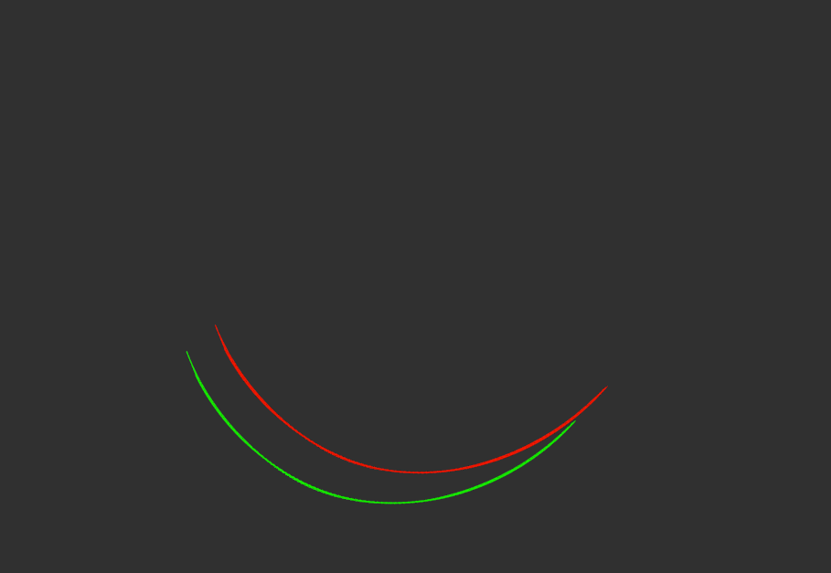

# Gazebo odom plugin
[中文版](Readme_cn.md)

这是一个非常不准确的里程计，具有误差积累，会产生漂移

从 p3d base controller 修改而来



绿色为真实轨迹，红色为经过一段时间漂移的轨迹

## 使用方法
```xml
  <gazebo>
    <plugin name="libgazebo_odom" filename="libgazebo_odom.so">
      <robotNamespace>/prius</robotNamespace>
      <bodyName>base_link</bodyName>
      <topicName>base_pose_odom</topicName>
      <frameName>map</frameName>
      <updateRate>100.0</updateRate>
      <gaussianNoise>0.05</gaussianNoise>
      <gaussianBias>0.05</gaussianBias>
    </plugin>
  </gazebo>
```